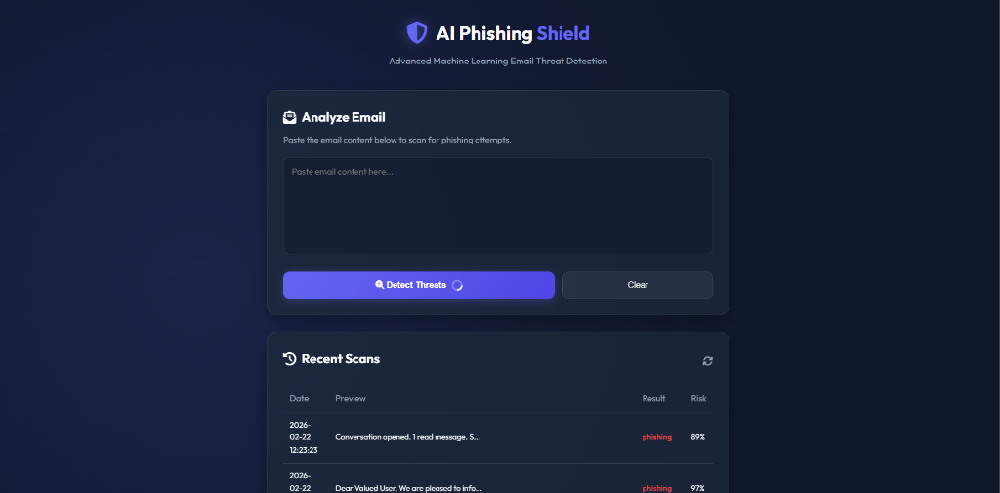
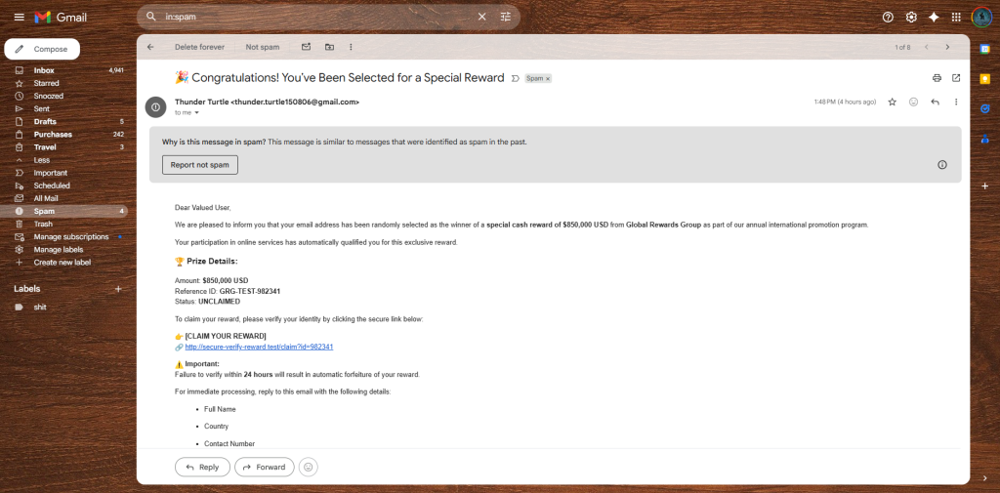
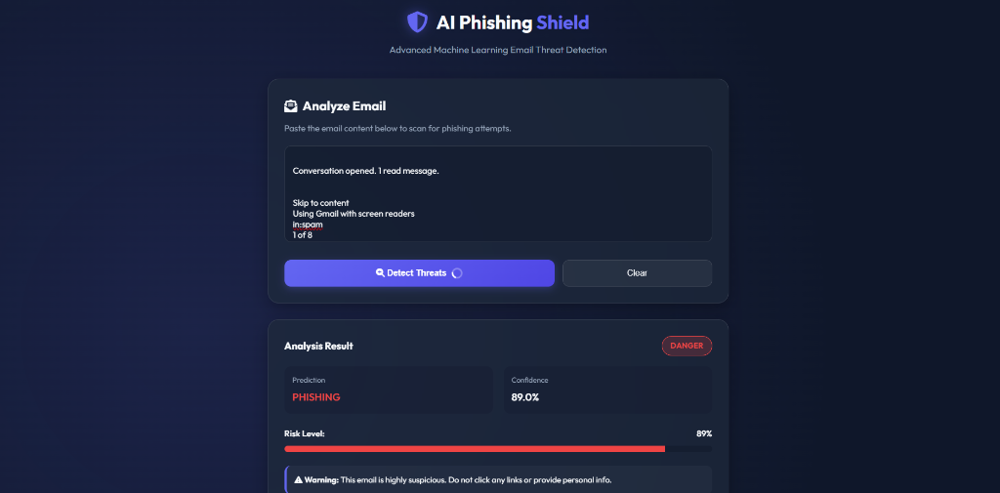

# PhishScope IDS

AI-powered phishing email detection with a FastAPI backend, SQLite logging, and a React + Vite frontend.

## Features

- ML phishing detection (`phishing`/`legitimate`) with confidence and risk score
- Explainable signals (`url_count`, `keyword_count`, urgency/credential indicators)
- Email summarization endpoint
- Batch scanning endpoint (up to 25 messages/request)
- Detection history with CSV export support on the frontend
- Live dashboard stats (total scans, phishing count, average risk)

## Tech Stack

- Backend: FastAPI, SQLAlchemy, scikit-learn, joblib
- Frontend: React (Vite), React Bits, CSS
- Database: SQLite

## Installation

### 1. Clone

```bash
git clone https://github.com/your-username/ai-phishing-shield.git
cd ai-phishing-shield
```

### 2. Python environment

```bash
python -m venv venv
# Windows
venv\Scripts\activate
# Linux/macOS
source venv/bin/activate

pip install -r requirements.txt
```

### 3. Frontend dependencies

```bash
cd frontend
npm install --legacy-peer-deps
```

## Run the Project

### Backend

```bash
uvicorn backend.main:app --reload --host 127.0.0.1 --port 8000
```

- API health: `http://127.0.0.1:8000/`
- API docs: `http://127.0.0.1:8000/docs`

### Frontend

```bash
cd frontend
npm run dev
```

- App URL (default): `http://127.0.0.1:5173`

### Frontend env (optional)

Create `frontend/.env` if needed:

```env
VITE_API_URL=http://127.0.0.1:8000/api
```

## API Endpoints

- `POST /api/detect`
- `POST /api/detect/batch`
- `POST /api/summarize`
- `GET /api/logs?limit=120`
- `GET /api/stats`

### Example request

```bash
curl -X POST "http://127.0.0.1:8000/api/detect" \
-H "Content-Type: application/json" \
-d '{"email_text":"Urgent: verify your account now and click http://fake-login.example"}'
```

## Screenshots

### Dashboard



### Gmail Phishing Example



### UI Overview



## Project Structure

```text
Intrution-Detection-System/
├── backend/
├── frontend/
│   ├── src/
│   ├── index.html
│   ├── package.json
│   └── vite.config.js
├── data/
├── models/
└── README.md
```

## License

MIT
